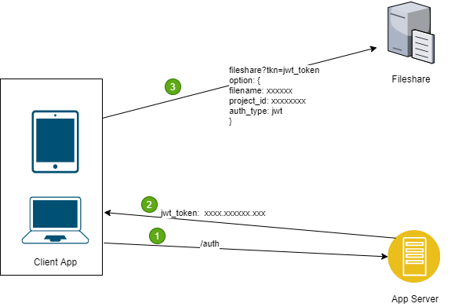

# Fileshare

Fileshare is a file sharing service as well as can act as file storage. This project is to provide flexible auth options, support multiple storage options available along with providing the basic file operation like upload a file, share a file, delete a file.

## Features 

- Presigned link generation for upload, download operation with specific criteria like time bound link, one time use
- Ablilty to validate the presigned operation using custom auth schemes
- Project based configuration

## Why this project?

While working on [Vartalap](https://vartalap.one9x.com), in order to implement features like profile pic, file sharing, a file server is required. Current vartalap server are not powerful enough to support another service like file(upload, downloads). So it is decided to use external service for file operations while maintaining the security, although there are number of  storage options like AWS S3, Azure storage but none of the service provides custom auth. One solution is to perform auth on [Vartalap](https://vartalap.one9x.com) server and then redirect them to desire service, but that will defeat the purpose as vartalap server is not that powerful to handle more external requests.

## Auth Strategy

1. Pre shared information auth strategy:  
This auth strategy validates the shared options at the time of creating pre-signed link (like client id, shared secret, etc). Fileshare service will validate shared information before performing operation. Client can shared the information in request header or as query params.  
  
Sequence:
    1. Client App request server to upload/download url.
    2. App Server send request to fileshare to generate pre-signed url along with auth option.
    3. Fileshare returns the pre-signed urls.
    4. App server send back pre-signed url to client app.
    5. Client App uploads/download file to the Fileshare along with auth option.
    6. Fileshare validates the information and process the request.

2. JWT auth strategy:  
This auth strategy validates the JWT token from the client app directly on the Fileshare server. In order to implement this stragtegy while setting up the fileshare project public key to validate the jwt token needs to be provided.  
  
Sequence:
    1. Client App perform auth with the App server.
    2. App Server returns the jwt token.
    3. Client App use the jwt_token with other required options to perform upload/download.
    4. Fileshare validates the jwt and proces the request.

## Resources

- Open api - [docs/openapi.yml](docs/openapi.yml)

